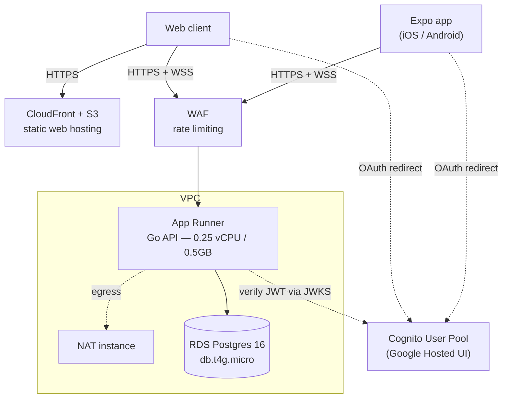
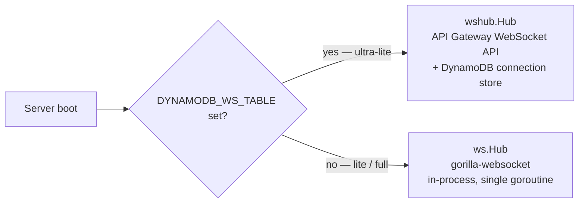
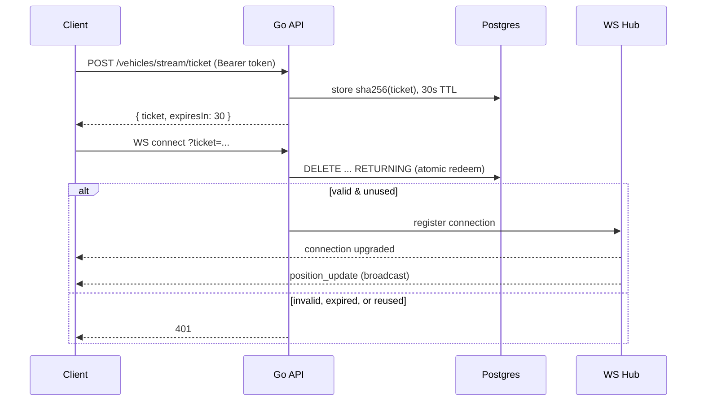

# Engineering Notes

Globify is a 3D globe visualization of a QSR (quick-service restaurant) supply chain — suppliers, distribution centers, restaurants, delivery routes, live truck GPS — built as a way to get real depth in Go, AWS CDK, Expo/React Native, and WebGL by building something that was actually interesting to look at. Globe-style visualizations (Google Earth, Mapbox GL, CesiumJS) always seemed like magic from the outside; this project is an attempt at a sliver of that magic from scratch, and it left a lot more respect for how much engineering sits underneath "zoom into a map."

These notes are the story behind the code: the constraints that shaped it, the problems that took longest to solve, and an honest account of what's finished versus still in flight.

## What it does

- A 3D globe with supplier/DC/restaurant points and animated, volume-weighted arcs showing flow through the supply chain.
- A **concentration risk** view — suppliers providing more than 30% of inbound volume to a distribution center are flagged, surfacing single-point-of-failure risk a plain map wouldn't show.
- **Disruption simulation** — disable a node, watch the network recompute reachability and reroute in real time.
- Click-to-inspect detail panels, platform-adaptive (slide-in on web, bottom sheet on mobile).
- Live truck GPS over WebSocket, with a simulator driving realistic movement when there's no real fleet to plug in.
- Google sign-in via Cognito Hosted UI.
- Three view modes — globe, flat-map, satellite.

## Architecture

React Native/Expo 54 on the frontend (Three.js via `react-three-fiber`, a custom GLSL tile shader) talking to a Go 1.26 API (chi, pgx, sqlc) backed by Postgres (Neon on the cheapest deploy tier). Infrastructure is AWS CDK v2, written in Go, with three interchangeable deployment profiles behind a single context flag — same domain code, different cost:

| Profile | Stack | Cost |
|---|---|---|
| `full` | EKS + RDS + NAT Gateway + WAF | ~$196/mo |
| `lite` | App Runner + RDS + NAT instance + WAF | ~$25/mo |
| `ultra-lite` | Lambda + API Gateway + Neon (external DB) | ~$1–3/mo |

Here's what `lite` actually looks like end to end — it's the profile that's easiest to reason about because it still runs a persistent process, unlike `ultra-lite`:

`ultra-lite` swaps App Runner for Lambda and RDS for Neon, and — because Lambda has no persistent process — swaps the WebSocket layer entirely. That swap is the more interesting story, below.

## Problems worth talking about

### Metro couldn't bundle three.js for web

Expo's Metro bundler doesn't support `import.meta` (used internally by three.js) and by default runs out of heap bundling `three` + `three-globe` for web. Two fixes, both still in place: `babel-plugin-transform-import-meta` in `apps/Globify/babel.config.js` transpiles away `import.meta` (tracked upstream as `expo/expo#30323`), and the web serve target runs with `NODE_OPTIONS=--max-old-space-size=8192` so the bundler doesn't OOM at the default ~4GB heap. The alternatives considered before landing on this stack — plain Three.js, `react-globe.gl`'s WebView approach — are in `openspec/changes/archive/2026-03-14-migrate-globe-spec-to-openspec/design.md`.

### There's no such thing as a WebSocket on Lambda

Lambda Function URLs have a 15-minute timeout and don't support connection upgrades — a WebSocket needs a long-lived process, which is exactly what Lambda doesn't offer. Rather than drop real-time tracking on the cheap tier, the API runs two hub implementations behind the same interface, picked at startup:

*(`services/supply-chain-api/cmd/server/main.go:84-102`)*

The gorilla hub was the original, only implementation; DynamoDB came later, once `ultra-lite` was actually deployed and it turned out Function URLs don't support WS upgrades at all. One routing quirk found along the way: on Lambda, the Web Adapter delivers API Gateway WebSocket events to `POST /events`, not the `$connect` route the docs imply (`internal/api/websocket_apigw.go`).

Both hubs sit behind the same client-facing handshake — a client can't open a raw WebSocket, it has to trade a valid access token for a short-lived ticket first, since browsers won't set an `Authorization` header on a WS upgrade request:

The ticket is single-use and hashed at rest (`internal/auth/ws_ticket.go`) specifically so the real access token never appears in a URL — the first version of this did put the raw token in `?token=`, which meant it landed in edge and access logs. That got replaced with the ticket exchange above as part of a broader auth-hardening pass (access-token validation instead of ID-token, a shared verifier for HTTP and WS, per-IP rate limiting).

### Designing for cost as a first-class constraint

All three deployment profiles existed from the start of the CDK project rather than one evolving into another (`infra/cdk/README.md` has the full per-profile cost breakdown — EKS's control plane alone is $73/mo). Treating "what does this cost to run" as a real constraint, not an afterthought, is what pushed the WebSocket architecture above into existing at all.

## On not reinventing MapLibre

The globe is hand-built — Three.js, a custom GLSL tile shader — to learn what's actually happening under something like Mapbox, not to ship the fastest product. Having built it: real respect for what MapLibre GL is, a C++-to-WASM renderer with years of tiling, labeling, and zoom work already solved. Right call for learning; wrong call for a product that needs true progressive zoom at scale — that's a MapLibre migration, not a bigger shader.

## Next up: moving to TanStack Query

There's a cleanup in flight that removes the `.catch(() => computeLocally(...))` pattern from about five call sites in the frontend — places where a failed API call silently recomputed risk or disruption data client-side instead of surfacing a real loading or error state. One of them hand-rolls a 300ms debounce around a `useEffect` for the risk/network queries. Once the local fallback is gone, those call sites need real query state — loading, error, retry — which today would mean writing that boilerplate by hand five separate times. TanStack Query replaces it with declarative caching, request dedup, and stale-while-revalidate, and it's fully Expo/React Native compatible, so it's landing as part of the same cleanup rather than a separate migration later.

## Current state and what's next

The most recent merged work: Google OAuth (replacing username/password), the DynamoDB WebSocket pivot above, an EventBridge-driven GPS simulator (fires every 2 minutes, heading-biased movement, so the demo has live motion without a real fleet feeding it), and a GitHub OIDC deploy role in place of long-lived IAM access keys.

Known, deliberately deferred items:

- **`WebOrigin` hardcoded** in `infra/cdk/main.go` — a CloudFront domain literal instead of wired dynamically from the web-hosting stack. Fails safe (Cognito rejects an unregistered redirect URI), but would break if that CloudFront distribution were ever torn down and recreated. Fix is a stack-construction reorder, known and just not urgent.
- **`GPS_SIM_TOKEN` in the EventBridge rule's static event input** (`infra/cdk/stacks/lambda_api.go`) — readable by anyone with `events:DescribeRule` access to the account. Can't just be deleted: it's the only thing distinguishing a genuine EventBridge tick from a spoofed public HTTP call, since the Lambda Web Adapter routes both through the same code path. Real fix is fetching it from Secrets Manager at invoke time. Low urgency — blast radius today is fake GPS pings, not data access.
- **Progressive globe textures** — `tileShader.ts` already composites up to 8 high-res tile overlays; the OpenSpec tracker for this feature undercounts progress relative to the code.
- CI/CD and broader security hardening are both explicitly in progress.
- Some duplication between the local/offline risk logic (TypeScript, unused fallback) and the live Go implementation — the TanStack Query cleanup above removes the last of it.

## Notable files

| File | What it does |
|---|---|
| `apps/Globify/src/components/Globe/tileShader.ts` | Custom GLSL shader compositing up to 8 high-res tile overlays, geographic-bounds alpha fade |
| `services/supply-chain-api/cmd/server/main.go:84-102` | Selects between the two WebSocket hub implementations |
| `services/supply-chain-api/internal/auth/ws_ticket.go` | Single-use, sha256-hashed, 30-second-TTL WebSocket auth tickets |
| `services/supply-chain-api/internal/auth/cognito.go` | Cognito JWT verification with JWKS caching |
| `services/supply-chain-api/internal/risk/` | Concentration risk scoring, ported from an earlier TypeScript prototype |
| `infra/cdk/stacks/` | The three cost-tiered CDK stacks, selected via `switch profile` in `infra/cdk/main.go` |
| `services/supply-chain-api/internal/api/gps_simulator.go` | EventBridge-driven GPS simulator behind the live truck motion |
