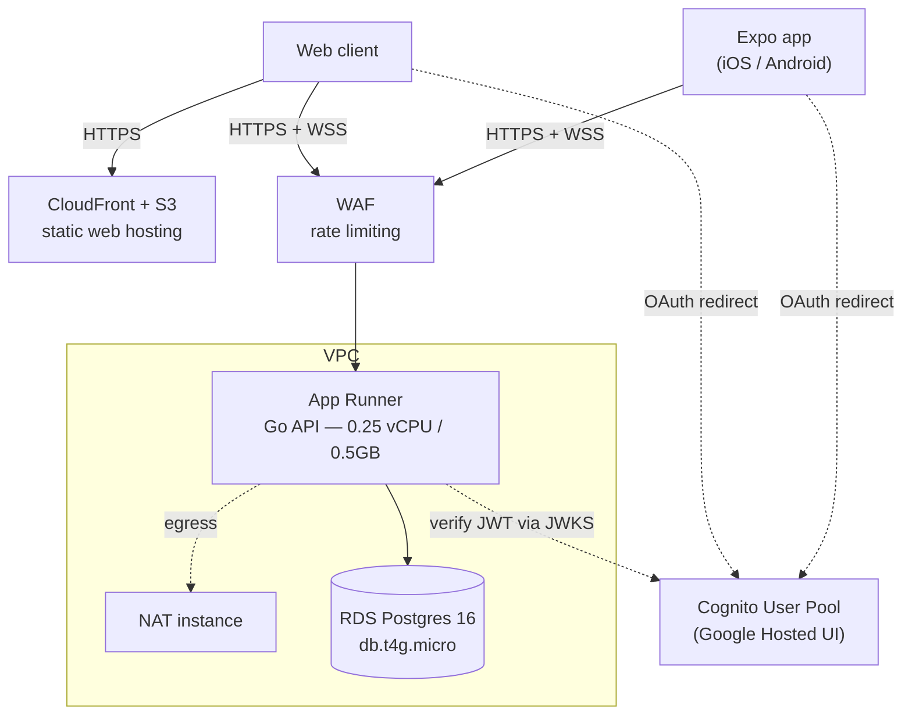
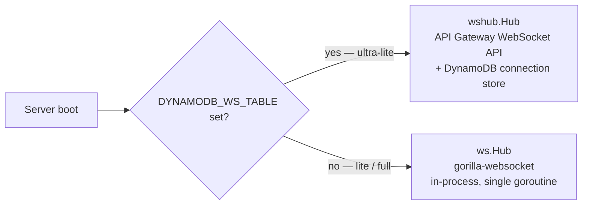
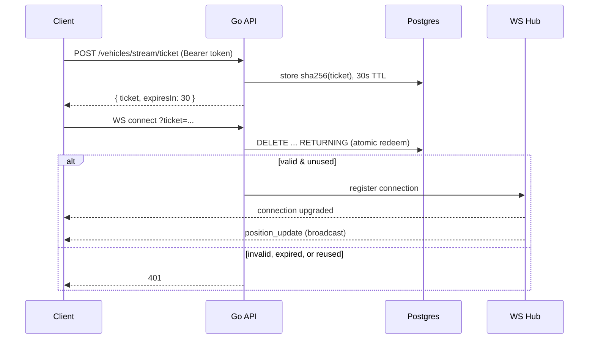

# Engineering Notes

Globify is a 3D globe visualization of a QSR (quick-service restaurant) supply chain — suppliers, distribution centers, restaurants, delivery routes, live truck GPS — built as a way to get real depth in Go, AWS CDK, Expo/React Native, and WebGL by building something that was actually interesting to look at. Globe-style visualizations (Google Earth, Mapbox GL, CesiumJS) always seemed like magic from the outside; this project is an attempt at a sliver of that magic from scratch, and it left a lot more respect for how much engineering sits underneath "zoom into a map."

These notes are the story behind the code: the constraints that shaped it, the problems that took longest to solve, and an honest account of what's finished versus still in flight.

## What it does

- A 3D globe with supplier/DC/restaurant points and animated, volume-weighted arcs showing flow through the supply chain.
- A **concentration risk** view — suppliers providing more than 30% of inbound volume to a distribution center are flagged, surfacing single-point-of-failure risk a plain map wouldn't show.
- **Disruption simulation** — disable a node, watch the network recompute reachability and reroute in real time.
- Click-to-inspect detail panels, platform-adaptive (slide-in on web, bottom sheet on mobile).
- Live truck GPS over WebSocket, with a simulator driving realistic movement when there's no real fleet to plug in.
- Google sign-in via Cognito Hosted UI.
- Three view modes — globe, flat-map, satellite.

## Architecture

React Native/Expo 54 on the frontend (Three.js via `react-three-fiber`, a custom GLSL tile shader) talking to a Go 1.26 API (chi, pgx, sqlc) backed by Postgres (Neon on the cheapest deploy tier). Infrastructure is AWS CDK v2, written in Go, with three interchangeable deployment profiles behind a single context flag — same domain code, different cost:

| Profile | Stack | Cost |
|---|---|---|
| `full` | EKS + RDS + NAT Gateway + WAF | ~$196/mo |
| `lite` | App Runner + RDS + NAT instance + WAF | ~$25/mo |
| `ultra-lite` | Lambda + API Gateway + Neon (external DB) | ~$1–3/mo |

Here's what `lite` actually looks like end to end — it's the profile that's easiest to reason about because it still runs a persistent process, unlike `ultra-lite`:

`ultra-lite` swaps App Runner for Lambda and RDS for Neon, and — because Lambda has no persistent process — swaps the WebSocket layer entirely. Those swaps, and why the cheap tier can't just be the expensive one scaled down, are the more interesting story, below.

## Problems worth talking about

### Metro couldn't bundle three.js for web

Expo's Metro bundler doesn't support `import.meta` (used internally by three.js) and by default runs out of heap bundling `three` + `three-globe` for web. Two fixes, both still in place: `babel-plugin-transform-import-meta` in `apps/Globify/babel.config.js` transpiles away `import.meta` (tracked upstream as `expo/expo#30323`), and the web serve target runs with `NODE_OPTIONS=--max-old-space-size=8192` so the bundler doesn't OOM at the default ~4GB heap. The alternatives considered before landing on this stack — plain Three.js, `react-globe.gl`'s WebView approach — are in `openspec/changes/archive/2026-03-14-migrate-globe-spec-to-openspec/design.md`.

### There's no such thing as a WebSocket on Lambda

Lambda Function URLs have a 15-minute timeout and don't support connection upgrades — a WebSocket needs a long-lived process, which is exactly what Lambda doesn't offer. Rather than drop real-time tracking on the cheap tier, the API runs two hub implementations behind the same interface, picked at startup:

*(`services/supply-chain-api/cmd/server/main.go:84-102`)*

The gorilla hub was the original, only implementation; DynamoDB came later, once `ultra-lite` was actually deployed and it turned out Function URLs don't support WS upgrades at all. One routing quirk found along the way: on Lambda, the Web Adapter delivers API Gateway WebSocket events to `POST /events`, not the `$connect` route the docs imply (`internal/api/websocket_apigw.go`).

The obvious follow-up: now that the DynamoDB hub exists, why keep two — why not run the `ultra-lite` design on `lite` and `full` too and delete the gorilla path? Because the API Gateway + DynamoDB hub isn't a better hub, it's a *workaround for not having a process*, and on `lite`/`full` there is a process. The gorilla hub is an in-memory `map[*Client]bool` with a buffered broadcast channel (`internal/ws/hub.go`): a broadcast is a fan-out of in-process socket writes, no network, no AWS API, no per-message cost. The same broadcast on the DynamoDB hub is a `Scan` of the connection table plus one `PostToConnection` HTTPS call to API Gateway *per connected client* (`internal/wshub/hub.go`) — every message pays a DynamoDB read and N managed-API round-trips, and every connect/disconnect is a DynamoDB write. On a persistent server that's strictly worse on latency and cost, and it drags two managed services (an API Gateway WebSocket API, a DynamoDB table) plus their IAM into tiers whose entire premise is *not* paying for managed extras — the thing that keeps `lite` at ~$25/mo. So the split isn't redundant duplication; each hub is matched to its compute substrate. Persistent process → hold connections in memory. No process → externalize connection state, and eat the per-message cost because there's no alternative. Neither design can be the single universal one: gorilla can't run where there's no long-lived process to hold the map, and DynamoDB shouldn't run where there is.

Both hubs sit behind the same client-facing handshake — a client can't open a raw WebSocket, it has to trade a valid access token for a short-lived ticket first, since browsers won't set an `Authorization` header on a WS upgrade request:

The ticket is single-use and hashed at rest (`internal/auth/ws_ticket.go`) specifically so the real access token never appears in a URL — the first version of this did put the raw token in `?token=`, which meant it landed in edge and access logs. That got replaced with the ticket exchange above as part of a broader auth-hardening pass (access-token validation instead of ID-token, a shared verifier for HTTP and WS, per-IP rate limiting).

### Lambda and a normal database don't get along either

Same root problem as the WebSocket one, one layer down. A conventional Postgres setup assumes a handful of long-lived connections: the API opens a pool once at startup — here, 10 (`internal/db/connection.go`) — and reuses them for every request. Lambda has no "once." Each concurrent request runs in its own isolated instance with its own pool, so a burst of 100 simultaneous requests tries to open roughly 100× the connections, and a small Postgres instance tops out at a few dozen. That's the classic Lambda-plus-RDS failure: `FATAL: too many connections`, arriving under exactly the load you were hoping to serve.

RDS is the wrong fit on this tier for two further reasons. It's an always-on instance — you pay for it 24/7 whether or not anyone hits the API, which by itself busts the ~$1–3/mo `ultra-lite` budget. And it lives inside the VPC, so the Lambda would have to be VPC-attached to reach it, dragging in the NAT/egress cost described below plus extra cold-start latency. Neon (serverless Postgres) inverts all three: it scales compute to zero when idle so an untouched database costs almost nothing, it's reachable over the public internet with TLS so no VPC or NAT is needed, and it fronts a built-in connection pooler that multiplexes many client connections onto a few real Postgres ones — exactly the shape Lambda's fan-out needs. So `ultra-lite` isn't "RDS, but cheaper"; it's a different database posture, chosen because Lambda's execution model is fundamentally at odds with one always-on Postgres box. (The password still has to be kept out of the code — it's read from SSM Parameter Store at cold start, `cmd/server/main.go:46`.)

### Designing for cost as a first-class constraint

All three deployment profiles existed from the start of the CDK project rather than one evolving into another — "what does this cost to run" was a design input, not an afterthought, and it's what drove both the WebSocket and database splits above.

The most concrete small example is the NAT. Anything in a private subnet — the App Runner container, the RDS instance — still needs *outbound* internet access to pull images, fetch Cognito's signing keys, and call AWS APIs, and that egress has to route through a NAT (network address translation) so private resources can reach out without being reachable from outside. AWS's managed **NAT Gateway** is the default, and it's surprisingly pricey for a side project: ~$32/mo just to exist, plus a per-GB data-processing fee, before any real traffic. `full` uses it (`stacks/network.go`) because at that tier you want the managed, highly-available version. `lite` swaps in a **NAT instance** (`stacks/network_lite.go`) — a single t4g.nano EC2 box running the NAT yourself: a few dollars a month, no high availability, the right trade when the whole tier targets ~$25/mo. `ultra-lite` sidesteps the question entirely — no VPC, no NAT — because Lambda and Neon both live on the public internet behind TLS. (`infra/cdk/README.md` has the full per-profile breakdown; EKS's control plane alone is $73/mo.)

## On not reinventing MapLibre

The globe is hand-built — Three.js, a custom GLSL tile shader — to learn what's actually happening under something like Mapbox, not to ship the fastest product. Having built it: real respect for what MapLibre GL is, a C++-to-WASM renderer with years of tiling, labeling, and zoom work already solved. Right call for learning; wrong call for a product that needs true progressive zoom at scale — that's a MapLibre migration, not a bigger shader.

## Backend as the single source of truth

The frontend used to carry its own copy of the domain — a ~700-line hardcoded seed dataset, and TypeScript ports of the Go risk/disruption compute logic — as a `.catch(() => computeLocally(...))` fallback at about five call sites, plus a mock-vehicle path for demoing without a live API. That layer predated the backend: it was how the globe got built and iterated on before there was a Go service to talk to, and it stuck around as an offline/dev-mode convenience afterward.

It came out for three reasons:

- **Duplication was a correctness liability, not just dead weight.** The frontend and backend copies of the risk/disruption math could silently drift — and one already had: the disruption endpoint's request shape was `{ disabledIds }` on the backend but `{ disabledNodes }` in the frontend fallback, a mismatch the mock path had been quietly masking.
- **A second, growing dataset baked into the client doesn't scale.** The seed data was small enough to hardcode when the demo had a couple hundred locations; it isn't the shape you want once real fleets, more suppliers, or higher-frequency GPS data are in play. Backend-only means the dataset can grow without a corresponding frontend rewrite.
- **Loading/error state was being silently swallowed.** A failed request recomputing locally *looked* like success — no error surfaced, no retry, no way to tell the user data was stale. That's the wrong default for a supply-chain risk tool.

The replacement is [TanStack Query](https://tanstack.com/query) (`apps/Globify/src/hooks/queries/`) as the sole data-fetching layer: declarative caching, request dedup, and real loading/error states in place of the hand-rolled 300ms debounce and manual fallback logic. The seed-dataset referential-integrity check that used to live in a frontend `.spec.ts` moved to a hermetic Go test (`services/supply-chain-api/internal/seed`) — the backend is now the only place that data exists, so that's the only place that needs to validate it.

One consequence worth calling out for local dev: there is no offline/mock mode anymore. The API (`docker compose up` in `services/supply-chain-api/`) must be running for the app to render anything — see the root `README.md` Quick Start.

## Current state and what's next

The most recent merged work: Google OAuth (replacing username/password), the DynamoDB WebSocket pivot above, an EventBridge-driven GPS simulator (fires every 2 minutes, heading-biased movement, so the demo has live motion without a real fleet feeding it), and a GitHub OIDC deploy role in place of long-lived IAM access keys.

Known, deliberately deferred items:

- **`WebOrigin` hardcoded** in `infra/cdk/main.go` — a CloudFront domain literal instead of wired dynamically from the web-hosting stack. Fails safe (Cognito rejects an unregistered redirect URI), but would break if that CloudFront distribution were ever torn down and recreated. Fix is a stack-construction reorder, known and just not urgent.
- **`GPS_SIM_TOKEN` in the EventBridge rule's static event input** (`infra/cdk/stacks/lambda_api.go`) — readable by anyone with `events:DescribeRule` access to the account. Can't just be deleted: it's the only thing distinguishing a genuine EventBridge tick from a spoofed public HTTP call, since the Lambda Web Adapter routes both through the same code path. Real fix is fetching it from Secrets Manager at invoke time. Low urgency — blast radius today is fake GPS pings, not data access.
- **Progressive globe textures** — `tileShader.ts` already composites up to 8 high-res tile overlays; the OpenSpec tracker for this feature undercounts progress relative to the code.
- CI/CD and broader security hardening are both explicitly in progress.

## Notable files

| File | What it does |
|---|---|
| `apps/Globify/src/components/Globe/tileShader.ts` | Custom GLSL shader compositing up to 8 high-res tile overlays, geographic-bounds alpha fade |
| `services/supply-chain-api/cmd/server/main.go:84-102` | Selects between the two WebSocket hub implementations |
| `services/supply-chain-api/internal/auth/ws_ticket.go` | Single-use, sha256-hashed, 30-second-TTL WebSocket auth tickets |
| `services/supply-chain-api/internal/auth/cognito.go` | Cognito JWT verification with JWKS caching |
| `services/supply-chain-api/internal/risk/` | Concentration risk scoring, ported from an earlier TypeScript prototype |
| `infra/cdk/stacks/` | The three cost-tiered CDK stacks, selected via `switch profile` in `infra/cdk/main.go` |
| `services/supply-chain-api/internal/api/gps_simulator.go` | EventBridge-driven GPS simulator behind the live truck motion |
