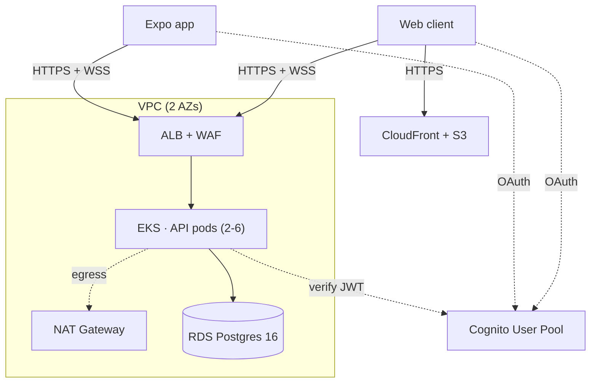
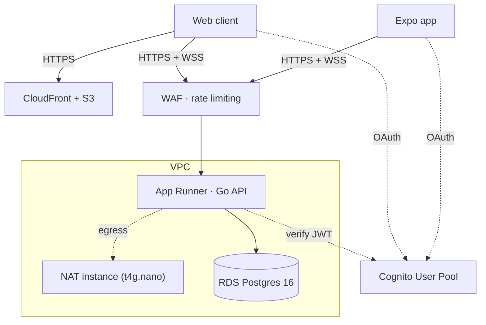
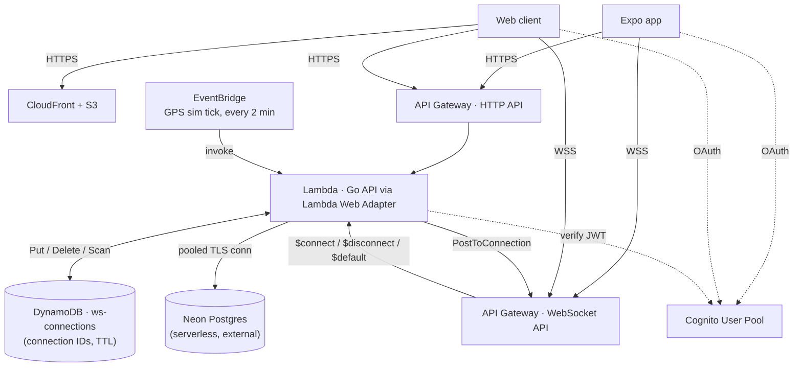
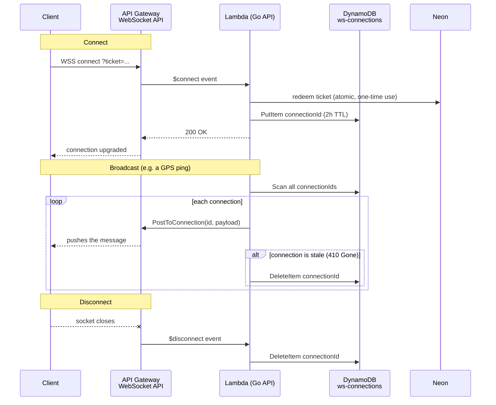
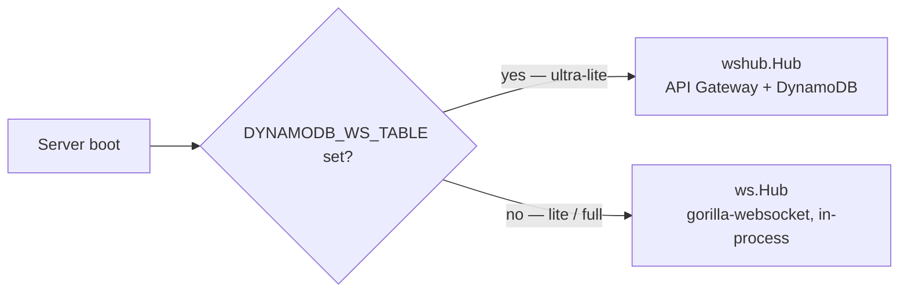
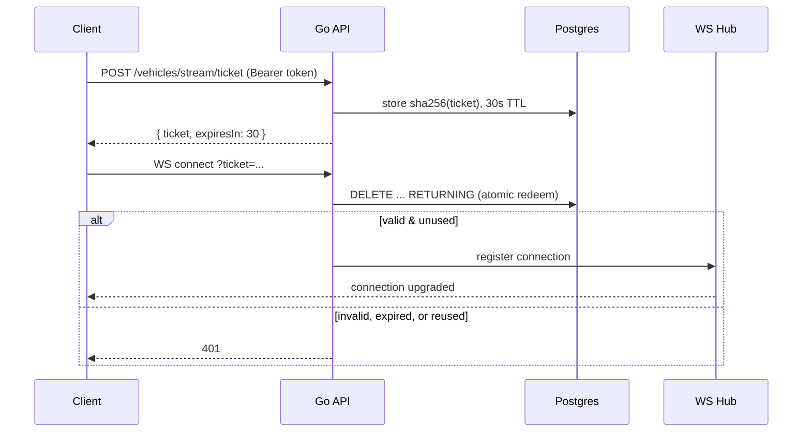

# Engineering Notes

A 3D globe showing a QSR (quick-service restaurant) supply chain — suppliers,
distribution centers, restaurants, live truck GPS, and disruption/risk
overlays. Built to get real depth in Go, AWS CDK, Expo/React Native, and
WebGL by building something worth looking at.

## What It Does

- 3D globe with supplier/DC/restaurant points and animated, volume-weighted
  flow arcs.
- **Concentration risk** — flags suppliers providing >30% of a DC's inbound
  volume (single-point-of-failure risk a plain map wouldn't show).
- **Disruption simulation** — disable a node, watch reachability recompute
  and reroute live.
- Live truck GPS over WebSocket, backed by a simulator when no real fleet
  is plugged in.
- Google sign-in via Cognito. Three view modes: globe / flat-map / satellite.

## Stack

| Layer | Tech |
|---|---|
| Frontend | Expo 54 (React Native + web), Three.js via `react-three-fiber`, custom GLSL tile shader |
| Backend | Go 1.26, chi, pgx, sqlc |
| Database | Postgres (Neon, serverless) |
| Infra | AWS CDK v2 (Go), 3 deployment profiles behind one context flag |
| Data fetching | TanStack Query |

## Deployment Profiles

Same domain code, three cost tiers, picked with `-c profile=<name>`:

| Profile | Compute | DB | Cost |
|---|---|---|---|
| `full` | EKS | RDS | ~$196/mo |
| `lite` | App Runner | RDS | ~$25/mo |
| **`ultra-lite`** ← *this is what's deployed* | Lambda | Neon | ~$1–3/mo |

---

## `full` — production shape

```mermaid
flowchart TB
    Mobile["Expo app"]
    Web["Web client"]
    Cognito["Cognito User Pool"]
    CF["CloudFront + S3"]

    subgraph VPC["VPC (2 AZs)"]
        ALB["ALB + WAF"]
        EKS["EKS · API pods (2-6)"]
        NAT["NAT Gateway"]
        RDS[("RDS Postgres 16")]
    end

    Web -->|HTTPS| CF
    Mobile -->|HTTPS + WSS| ALB
    Web -->|HTTPS + WSS| ALB
    ALB --> EKS
    EKS --> RDS
    EKS -.->|egress| NAT
    Mobile & Web -.->|OAuth| Cognito
    EKS -.->|verify JWT| Cognito
```

Everything is a long-lived process: EKS pods hold WebSocket connections in
memory, RDS is always-on. Fully managed, highly available, expensive.

## `lite` — staging/demo shape

```mermaid
flowchart TB
    Mobile["Expo app"]
    Web["Web client"]
    Cognito["Cognito User Pool"]
    CF["CloudFront + S3"]
    WAF["WAF · rate limiting"]

    subgraph VPC
        API["App Runner · Go API"]
        NAT["NAT instance (t4g.nano)"]
        RDS[("RDS Postgres 16")]
    end

    Web -->|HTTPS| CF
    Mobile -->|HTTPS + WSS| WAF
    Web -->|HTTPS + WSS| WAF
    WAF --> API
    API --> RDS
    API -.->|egress| NAT
    Mobile & Web -.->|OAuth| Cognito
    API -.->|verify JWT| Cognito
```

Still one persistent process (App Runner container), so it still holds
WebSocket connections in memory just like `full`. The only swaps are managed
→ cheap building blocks: NAT Gateway → NAT instance, EKS → App Runner.

## `ultra-lite` — what we actually run

Lambda has **no persistent process**, so it can't hold WebSocket connections
in memory the way `full`/`lite` do. That one constraint reshapes both the
real-time layer and the database choice below.

```mermaid
flowchart TB
    Mobile["Expo app"]
    Web["Web client"]
    Cognito["Cognito User Pool"]
    CF["CloudFront + S3"]
    HttpApi["API Gateway · HTTP API"]
    WsApi["API Gateway · WebSocket API"]
    Lambda["Lambda · Go API via Lambda Web Adapter"]
    DDB[("DynamoDB · ws-connections\n(connection IDs, TTL)")]
    Neon[("Neon Postgres\n(serverless, external)")]
    EventBridge["EventBridge\nGPS sim tick, every 2 min"]

    Web -->|HTTPS| CF
    Mobile -->|HTTPS| HttpApi
    Web -->|HTTPS| HttpApi
    Mobile -->|WSS| WsApi
    Web -->|WSS| WsApi
    HttpApi --> Lambda
    WsApi -->|"$connect / $disconnect / $default"| Lambda
    Lambda <-->|Put / Delete / Scan| DDB
    Lambda -->|PostToConnection| WsApi
    Lambda -->|pooled TLS conn| Neon
    EventBridge -->|invoke| Lambda
    Mobile & Web -.->|OAuth| Cognito
    Lambda -.->|verify JWT| Cognito
```

No VPC, no NAT — Lambda and Neon both sit on the public internet behind TLS.

### How a WebSocket message actually moves

Every event — connect, a GPS broadcast, disconnect — is a separate,
stateless Lambda invocation. Nothing is held in memory between them; state
lives in DynamoDB instead.

```mermaid
sequenceDiagram
    participant C as Client
    participant WS as API Gateway<br/>WebSocket API
    participant L as Lambda (Go API)
    participant DDB as DynamoDB<br/>ws-connections
    participant N as Neon

    Note over C,WS: Connect
    C->>WS: WSS connect ?ticket=...
    WS->>L: $connect event
    L->>N: redeem ticket (atomic, one-time use)
    L->>DDB: PutItem connectionId (2h TTL)
    L-->>WS: 200 OK
    WS-->>C: connection upgraded

    Note over L,C: Broadcast (e.g. a GPS ping)
    L->>DDB: Scan all connectionIds
    loop each connection
        L->>WS: PostToConnection(id, payload)
        WS-->>C: pushes the message
        alt connection is stale (410 Gone)
            L->>DDB: DeleteItem connectionId
        end
    end

    Note over C,WS: Disconnect
    C--xWS: socket closes
    WS->>L: $disconnect event
    L->>DDB: DeleteItem connectionId
```

A broadcast here is a DynamoDB `Scan` + one HTTPS call per connected
client — real cost, unlike the in-memory fan-out `full`/`lite` use. That
tradeoff only makes sense because Lambda gives no alternative; see
`internal/wshub/hub.go` and `internal/api/websocket_apigw.go`.

### Why Neon instead of RDS here

Lambda has no "once" — every concurrent request is its own instance with
its own DB pool, so a burst of requests opens a burst of connections. A
small Postgres box tops out fast (`FATAL: too many connections`). RDS also
can't help without a VPC (NAT cost) and bills 24/7 whether or not anyone
hits the API.

Neon fixes all three:

- **Scales to zero** — an idle database costs ~nothing.
- **Public internet + TLS** — no VPC, no NAT.
- **Built-in connection pooler** — many Lambda instances multiplex onto a
  few real Postgres connections.

### Why DynamoDB *too*, if Neon already exists?

They store different things. **Neon** is the system of record — suppliers,
routes, risk data, and the one-time WebSocket auth tickets. **DynamoDB**
holds nothing but ephemeral `connectionId → expiresAt` rows, alive for a
couple of hours at most.

Routing that connection registry through Neon instead would work, but:

- Every connect/disconnect would be a write against the relational DB —
  churn that has nothing to do with business data.
- It would wake Neon's autosuspended compute on every socket open/close,
  undermining the "scales to zero" property that makes it cheap.
- DynamoDB's pay-per-request pricing sits in the free tier at this scale,
  and TTL auto-expires stale rows with zero cleanup code.
- It's the pattern AWS's own API Gateway WebSocket docs use — a Lambda
  needs `execute-api:ManageConnections` IAM either way, so a purpose-built
  KV store for connection state is the path of least resistance.

Short version: Neon is the database; DynamoDB is a scratch pad for "who's
currently connected," sized and priced for exactly that job.

---

## Why two WebSocket hub implementations

The API picks a hub at startup based on environment, not profile name —
so the same binary runs on any tier:

```mermaid
flowchart LR
    Boot["Server boot"] --> Check{"DYNAMODB_WS_TABLE set?"}
    Check -->|yes — ultra-lite| DDB["wshub.Hub<br/>API Gateway + DynamoDB"]
    Check -->|no — lite / full| Gorilla["ws.Hub<br/>gorilla-websocket, in-process"]
```

*(`services/supply-chain-api/cmd/server/main.go:84-102`)*

Not redundant — each is matched to what its compute substrate can offer.
`ws.Hub` is an in-memory `map[*Client]bool`; broadcasting is free, in-process
socket writes. That only works where a process lives long enough to hold
the map. Where it doesn't (Lambda), connection state has to live somewhere
else, and every broadcast pays for it — that's the DynamoDB hub above.
Running the DynamoDB design on `full`/`lite` would trade a free operation
for a billed one, for no benefit.

## Auth handshake (both hubs)

Browsers can't set an `Authorization` header on a WebSocket upgrade, so
clients trade an access token for a short-lived, single-use ticket first:

```mermaid
sequenceDiagram
    participant C as Client
    participant A as Go API
    participant P as Postgres
    participant H as WS Hub

    C->>A: POST /vehicles/stream/ticket (Bearer token)
    A->>P: store sha256(ticket), 30s TTL
    A-->>C: { ticket, expiresIn: 30 }
    C->>A: WS connect ?ticket=...
    A->>P: DELETE ... RETURNING (atomic redeem)
    alt valid & unused
        A->>H: register connection
        H-->>C: connection upgraded
    else invalid, expired, or reused
        A-->>C: 401
    end
```

The raw access token never appears in a URL (it did once, and ended up in
edge/access logs — this ticket exchange replaced that). See
`internal/auth/ws_ticket.go`.

*Tickets stay in Postgres, not DynamoDB, even on `ultra-lite` — they're
minted and redeemed within a single request/response, so there's no
independent churn to protect Neon from, unlike connection IDs.*

## Why TanStack Query

The frontend used to carry its own copy of the domain — a hardcoded seed
dataset plus TypeScript ports of the Go risk/disruption logic — as a
`.catch(() => computeLocally(...))` fallback. It was cut for three reasons:

- **It drifted.** The disruption endpoint's request shape didn't match
  between frontend and backend copies, silently masked by the fallback.
- **It didn't scale** — a dataset baked into the client can't grow with
  real fleets or suppliers.
- **It hid failures** — a failed request recomputing locally looked like
  success, with no error, no retry, no staleness signal.

[TanStack Query](https://tanstack.com/query) (`apps/Globify/src/hooks/queries/`)
replaced it as the sole data-fetching layer: declarative caching, request
dedup, and real loading/error states, in place of hand-rolled debounce and
fallback logic. There's no offline/mock mode anymore — the API must be
running for the app to render anything.

## On not reinventing MapLibre

The globe is hand-built — Three.js, a custom GLSL tile shader — to learn
what's actually happening under something like Mapbox, not to ship the
fastest product. Having built it: real respect for MapLibre GL, a
C++-to-WASM renderer with years of tiling, labeling, and zoom work already
solved. Right call for learning; wrong call for a product that needs true
progressive zoom at scale — that's a MapLibre migration, not a bigger
shader.

## Cost as a first-class constraint

All three profiles existed from day one — "what does this cost" was a
design input, not an afterthought. The clearest example: outbound internet
access from a private subnet needs a NAT. AWS's managed **NAT Gateway** is
~$32/mo before any traffic; `full` uses it for the HA guarantee. `lite`
swaps in a **NAT instance** — a single t4g.nano EC2 box — for a few
dollars a month. `ultra-lite` skips the question: no VPC, so no NAT at all.

## Current State

Recently merged: Google OAuth, the DynamoDB WebSocket pivot above, an
EventBridge-driven GPS simulator (every 2 minutes, heading-biased
movement), and a GitHub OIDC deploy role replacing long-lived IAM keys.

Known, deliberately deferred:

- **`WebOrigin` hardcoded** in `infra/cdk/main.go` instead of wired
  dynamically. Fails safe (Cognito rejects unregistered redirect URIs) but
  would break if that CloudFront distribution were ever recreated.
- **`GPS_SIM_TOKEN`** lives in the EventBridge rule's static event input —
  readable by anyone with `events:DescribeRule`. Blast radius is fake GPS
  pings, not data access; real fix is Secrets Manager at invoke time.
- CI/CD and broader security hardening are both in progress.

## Notable Files

| File | What it does |
|---|---|
| `apps/Globify/src/components/Globe/tileShader.ts` | Custom GLSL shader, up to 8 composited tile overlays |
| `services/supply-chain-api/cmd/server/main.go:84-102` | Picks the WebSocket hub implementation |
| `services/supply-chain-api/internal/wshub/hub.go` | Ultra-lite hub: API Gateway + DynamoDB |
| `services/supply-chain-api/internal/ws/hub.go` | Full/lite hub: in-process gorilla-websocket |
| `services/supply-chain-api/internal/auth/ws_ticket.go` | Single-use, hashed, 30s-TTL WS auth tickets |
| `services/supply-chain-api/internal/auth/cognito.go` | Cognito JWT verification, JWKS caching |
| `services/supply-chain-api/internal/risk/` | Concentration risk scoring |
| `infra/cdk/stacks/` | The three cost-tiered CDK stacks (`infra/cdk/main.go` picks one via `profile`) |
| `services/supply-chain-api/internal/api/gps_simulator.go` | EventBridge-driven GPS simulator |
